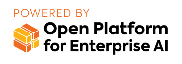

# Getting Started with Enterprise RAG

Intel AI for Enterprise RAG makes turning your enterprise data into actionable insights easy while delivering better total cost of ownership (TCO) than the alternative. Powered by Intel Gaudi AI accelerators and Intel Xeon processors, Intel AI for Enterprise RAG integrates components from industry partners to offer a streamlined approach to deploying solutions for enterprises. It scales seamlessly with proven orchestration frameworks, giving you the flexibility and choice your enterprise needs.

**ChatQnA**

The ChatQnA solution uses retrieval augmented generation (RAG) architecture, which is quickly becoming the industry standard for chatbot development. It combines the benefits of a knowledge base (via a vector store) and generative models to reduce hallucinations, maintain up-to-date information, and leverage domain-specific knowledge. The architecture diagram for ChatQnA solution that will be deployed using this guide is as shown below:

## Prerequisites

